# 24.1 | Starting DevOps and VM's

## 1. Why deploy on the internet, isn’t localhost enough?

What's wrong in the following message? Is jimmy lying?


## 2. Domains vs IPs

### LocalHost

- "Localhost" refers to the computer you're currently working on. 

- It's essentially a loopback address that points to the machine itself, allowing it to communicate with itself over a network. 

- In technical terms, the IP address for localhost is usually `127.0.0.1` for IPv4, or `::1` for IPv6.

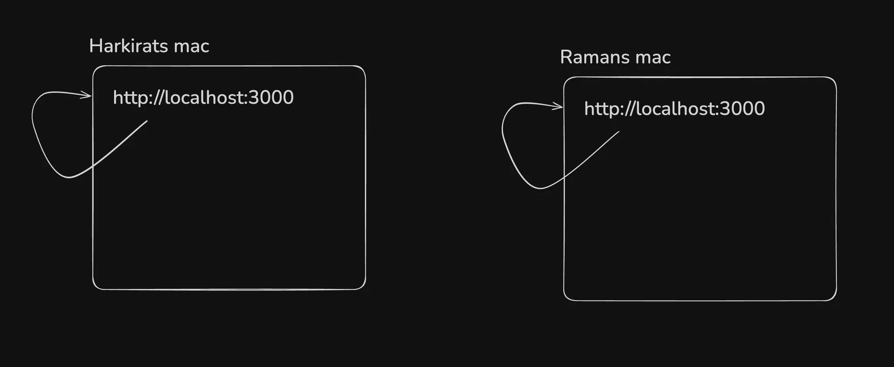

### ping command

- Try running

```solidity
ping localhost
```

- Now try pinging google

```solidity
ping google.com
```

Notice google points to a different `IP address` .

### IP (Internet Protocol) Address:

- An **IP address** is a unique string of numbers that identifies a device on a network, like the internet. Think of it like a **house address**: it's how computers (or any devices on the network) know where to send information.

- For example, `192.168.1.1` is an IP address.

- An **IP address** is essential for routing data on the internet, but it's not the most human-friendly system.

- Range of IPV4 addresses are from 0 to 255. For example `0-255.0-255.0-255.0-255`. Thus the total number of IP's are limited.

### Domain name

- A **domain name** is the readable, human-friendly address we use to access websites, like `google.com` or `example.org`.

- Domains are a higher-level abstraction that makes it easier for us to remember websites instead of trying to recall a string of numbers (like an IP address).

- For instance, when you type `www.google.com` into your browser, your computer looks up that domain name and finds the corresponding IP address, then connects to the website.

### Domain name vs Phone number

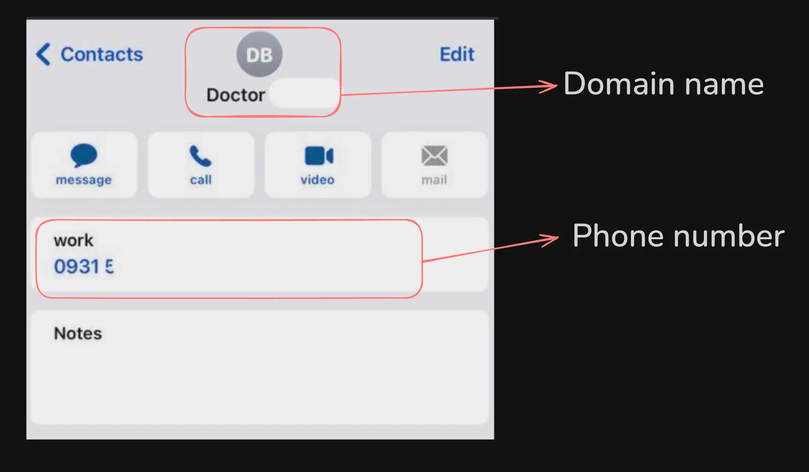

### Limited IP addresses

- There are limited number of IP addresses in the world (ipv4 specially). 

- So it’s not very easy for us to get a public IP. 

- Most IPs are blocked by cloud providers or Big companies (JIO)

## 3. Local network, routing (mild hosting)

- If you have multiple laptops on the same `wifi router`, you can access one machine from another by using their private IP address. 

- The reason why it is called as private IP is because it's not exposed on the internet yet.

- This is a `mild` version of deploying your app on your `local network` (or whats called the intranet)

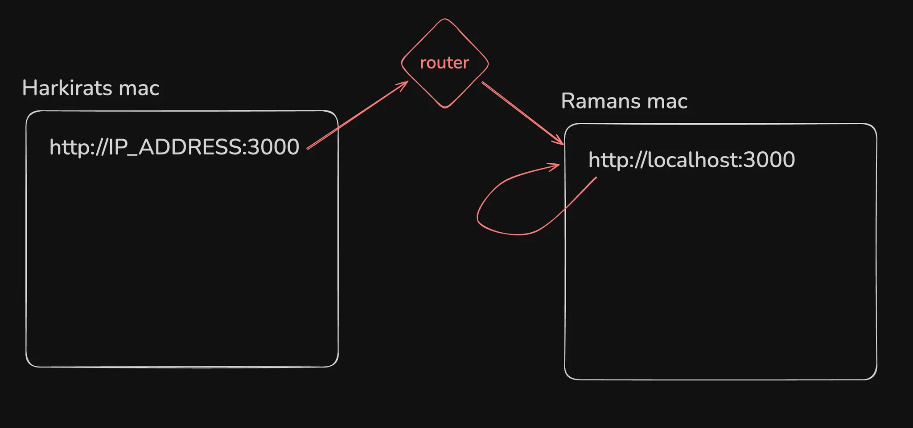

### Steps to follow

1. Start a node.js process locally on port 3000

```js
const express = require('express');
const app = express();
const port = 3000;

app.get('/', (req, res) => {
    res.send('Hello, World!');
});

app.listen(port, () => {
    console.log(`Server is running on http://localhost:${port}`);
});
```

2. Find the IP of your machine on the local network

```bash
ifconfig or ipconfig
```

This commands shows all the network interfaces i.e various ways to reach your machine.

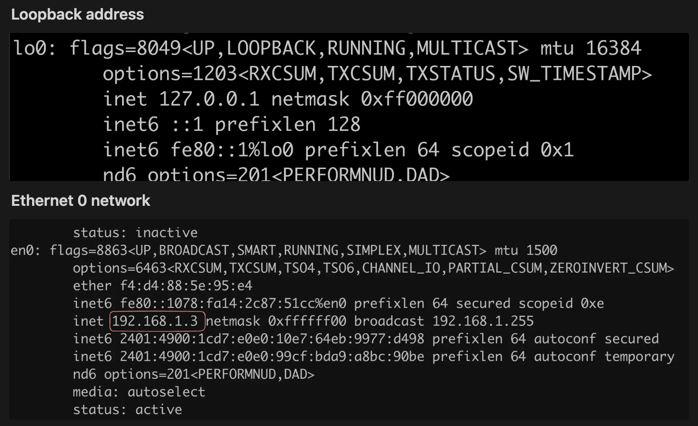

**Note :** If I go to `192.168.1.3:3000` on my phone, I should be able to visit the website


### Hosts file

You can override what your domain name resolves to by overriding the hosts file.

```bash
# Mini DNS server
vi /etc/hosts
127.0.0.01	harkirat.100xdevs.com
```


**NOTE** : Can you think of how you can phis your friend into giving their credentials by using this approach?

## 4. How to deploy apps (actual hosting)?

1. Renting servers on a cloud.
2. Renting compute yourself in data centers.
3. Self hosting (buying a CPU rack in your house).
4. Serverless providers.
5. Cloud native options (k8s).

## 5. What is a VM


- VMs run on a physical server (called the **host**) but are abstracted through a layer of virtualization software called a **hypervisor** (e.g., VMware, KVM). 

- This hypervisor divides the host machine’s resources (CPU, memory, storage) into separate virtual machines.

- Each VM acts like a completely independent machine, even though they share the underlying hardware. 

- You can run different operating systems and applications in different VMs on the same physical server.

- VMs are highly flexible and easy to scale. You can quickly spin up, modify, or delete VMs, and you can consolidate multiple workloads on a single server.

- The virtualization layer introduces a slight overhead in terms of performance because the hypervisor needs to manage resources and ensure each VM operates independently. 

- However, with modern hypervisors and powerful hardware, this overhead is minimal.

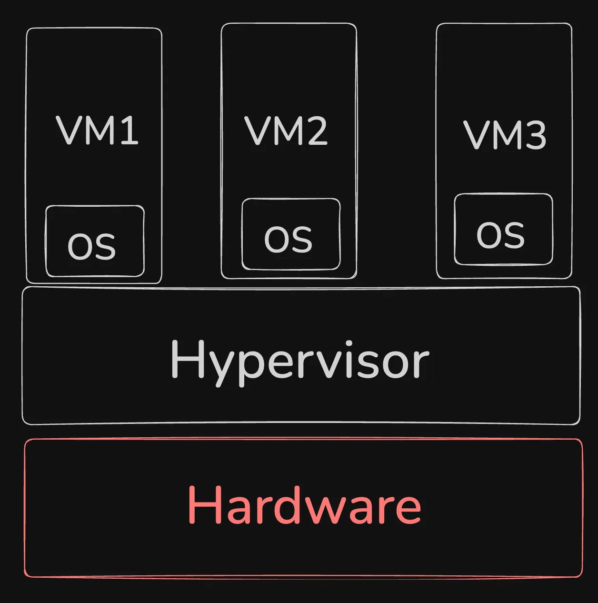

## 6. Bare metal servers

- In a bare-metal setup, an operating system (OS) runs directly on the physical hardware without a hypervisor in between. There’s no virtualization layer.

- Since there's no hypervisor, bare-metal systems tend to offer better performance, as the OS can directly access all the server’s resources without sharing them with other instances. 

- This is especially important for high-performance applications like large databases, gaming servers, or mining crypto

- With bare-metal, you’re typically limited to the resources (CPU, memory, storage) of the actual physical server. You can't dynamically allocate resources like you can in a VM.

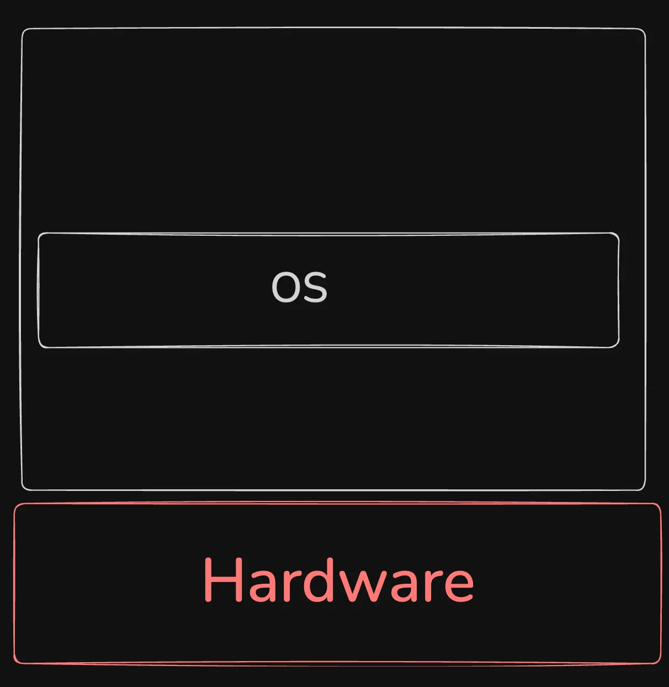

## 7. SSH protocol, password based auth

- The **SSH protocol** (Secure Shell) is a cryptographic network protocol that allows secure communication between two systems, typically for remote administration. 

- It’s most commonly used to log into remote servers and execute commands, but it also facilitates secure file transfers and other operations.

- The default ssh port is 22. 

### Key Features of SSH:

1. **Encryption**: SSH encrypts the data that’s sent between the client and the server, so even if someone intercepts the connection, they can’t read the data. This makes it much more secure than older protocols like Telnet or FTP, which transmit data in plaintext.

2. **Authentication**: SSH can use two methods of authentication:
    - **Password-based**: You enter a password to authenticate yourself to the remote system.
    - **Public Key-based**: A more secure method, where the client uses a private key to authenticate, and the server checks it against the corresponding public key. This eliminates the need for passwords and provides an extra layer of security.

3. **Integrity**: SSH ensures the integrity of data, meaning that data cannot be tampered with while it’s in transit. If someone tries to alter the data being sent, the connection will be immediately disrupted.

### Password based

While setting up a server, select password based authentication

**Example from `digitalocean`**

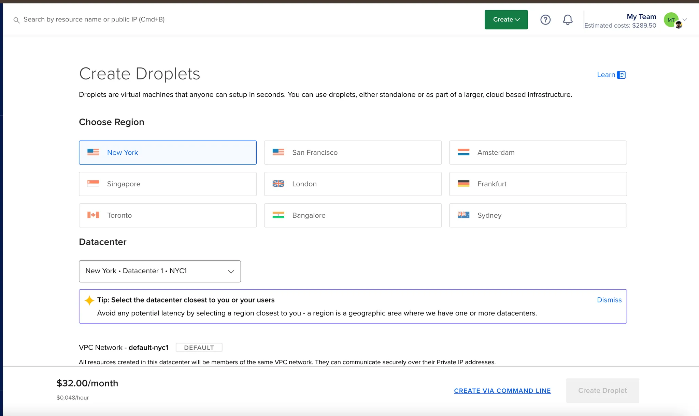

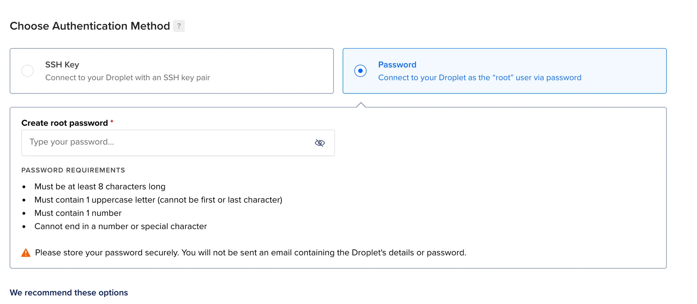

```bash
ssh ubuntu@SERVER_IP
or
ssh root@SERVER_IP
```

**NOTE** : `root` is the user that you are logging in as.

## 8. SSH protocol, ssh keypair based

- It's basically identifying yourself to a machine.

    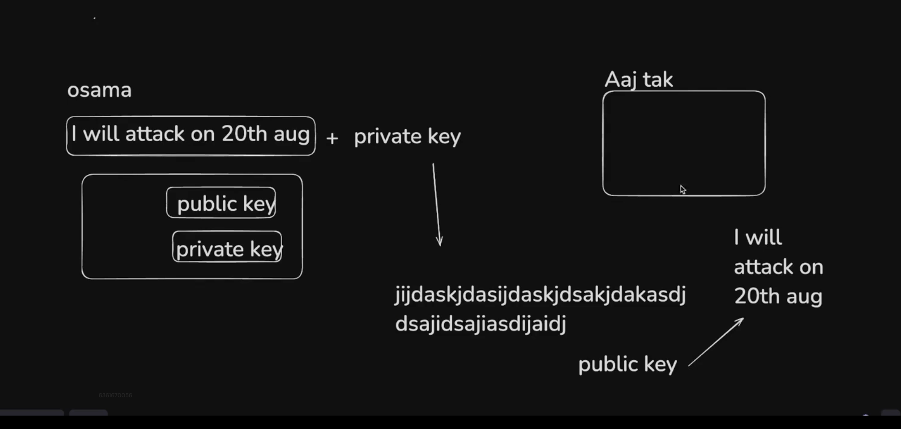

    **NOTE** : This can happen vice-versa.

- It's basically telling the server that I have a private key, here is my public key. So whenever I try to ssh into the server using the private key, that public key in the sever verfies my identity.

    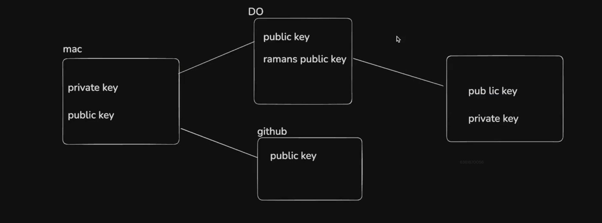

    **NOTE** : The extension of public key file is `.pub`. It stays in `/Users/amithbv/.ssh`. Private key file has no extension.

    For example, private key is `id_rsa`, public key is `id_rsa.pub`.

- Generate a new public private keypair : 

    ```bash
    ssh-keygen
    OR
    /User/harkiratsingh/.ssh/id_rsa
    ```
​
- Explore your public and private key : 

    ```bash
    cat ~/.ssh/id_rsa.pub
    cat ~/.ssh/id_rsa
    ```

- Once you create a VM and ssh into it using public-private key, your public key will be stored in `.ssh/authorized_keys` file.

- Try adding it to digitalocean and ssh using it.

    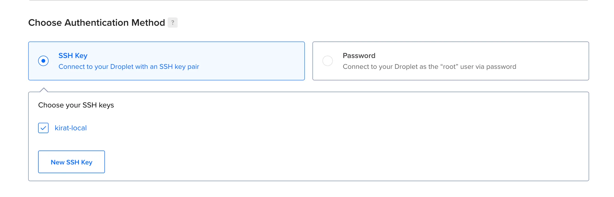

    ```bash
    ssh ubuntu@IP
    or
    git clone git@github.com:100xdevs-cohort-3/week-24-deposit-with-infra.git (try a private repo)
    ```

    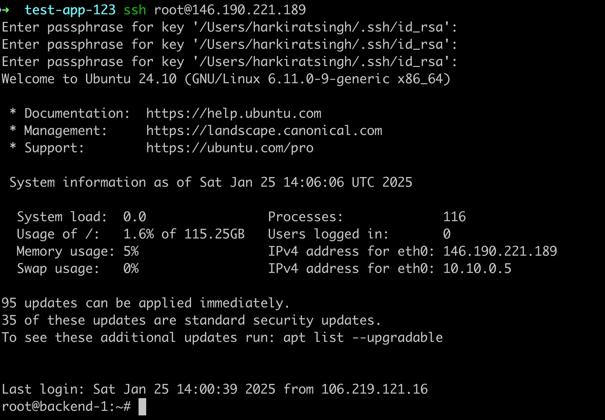

- Check authorized_keys

    ```bash
    cat ~/.ssh/authorized_keys
    ```

        💡 How to hack your friends laptop?

        Put your public key in your friends laptop as an authorized key.

## Algorithms for public key cryptography

The `ssh-keygen` tool can generate SSH key pairs using several different cryptographic algorithms, depending on what you choose during the key creation process. By default, it typically uses **RSA**, but you can specify other algorithms as well. Here are the most commonly used algorithms:

### **1. RSA (Rivest–Shamir–Adleman)**

- **Default Algorithm** (for most systems): The `ssh-keygen` tool uses RSA by default when creating keys.
- RSA is a widely-used public-key algorithm that provides strong security.

### **2. Ed25519**

- **A newer and more secure option**: Ed25519 is a modern elliptic curve algorithm that is designed to provide both high security and efficiency.
- It’s **faster**, more **secure** for the same key size, and less prone to certain vulnerabilities compared to RSA.

```solidity
ssh-keygen -t ed25519
```

### **3. ECDSA (Elliptic Curve Digital Signature Algorithm)**

- **Another elliptic curve algorithm**, which is considered a more secure and efficient alternative to RSA for most use cases.

## 9. IP address of your machine

If you get a VM on digitalocean, there is an associated IP address to it. This is a public IP address that you can use to reach the server anywhere around the world.

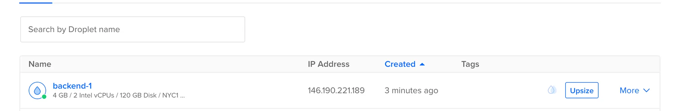