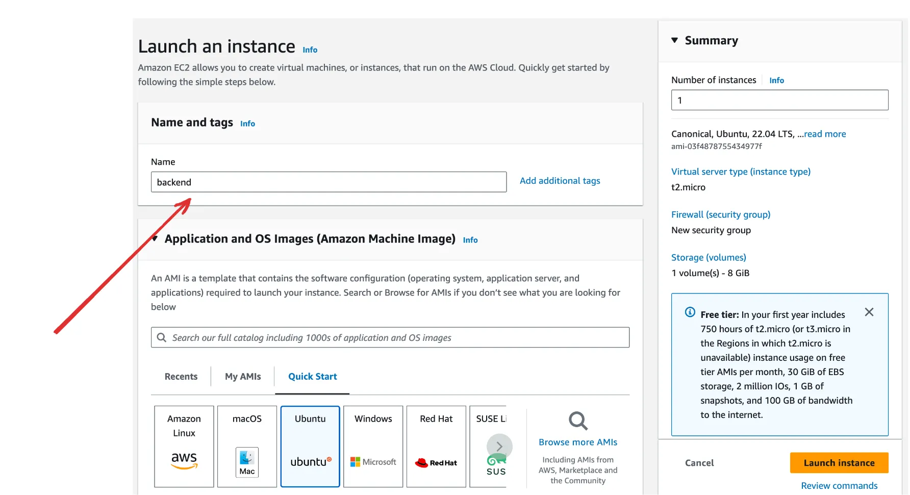
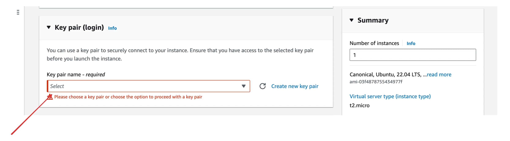
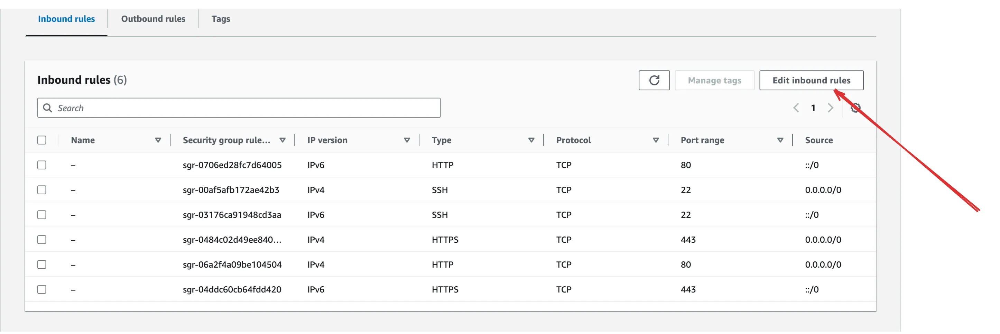
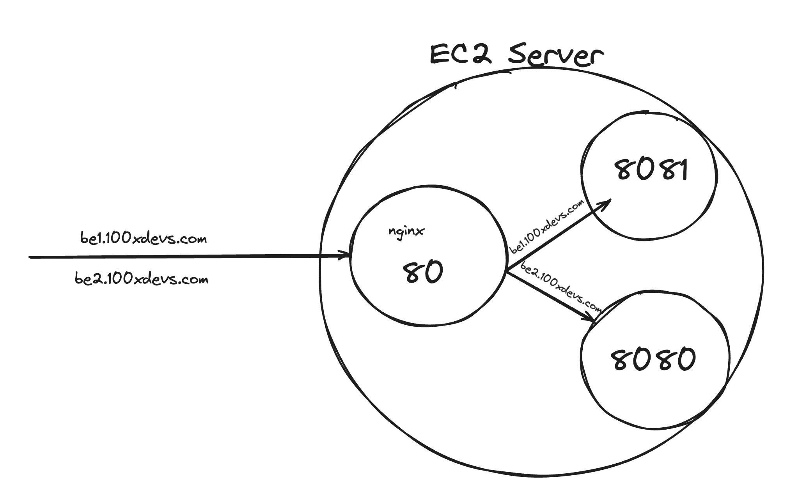

# 24.2 | AWS Deplyment and Reverse proxies

### Step 1 - What is AWS ?

AWS is Amazon’s `cloud` service.

It let’s you :

1. Rent servers
2. Manage domains
3. Upload objects (mp4 files, jpgs, mp3s …)
4. Autoscale servers
5. Create k8s clusters

##

### Step 2 - EC2 servers

- `VMs` on AWS are called `EC2 Servers`.

- `EC2` stands for `Elastic compute Version 2`.

    1. **Elastic** - Can increase/decrease the size of the machine.
    2. **Compute** - It is a machine.

- You can spin up a new EC2 instance from the aws dashboard.


**NOTE** : Whenever a VM(EC2) in AWS, is restarted, the public IP of the VM keeps changing. To have a constant IP address we need to set `Elastic IP`. 


**NOTE** : Short steps

1. gave my VM a name  
2. Selected the OS  
3. Selected the OS version  
4. Selected the Instance type  
5. Created a new keypair, set it  
6. Added a new sec group, opened port 3000 and 22.  
7. Add 16 gb storage.

##

### Step 3 - Creating a new EC2 server

1. Click on Launch a new instance

    

2. Give a name

    

3. Select an OS and the version of that OS 

    

4. Select size

    

5. Create a new Key pair

    

6. Allow traffic on http/https

    

7. Select size again

    

##

### Step 4 - SSH into server

1. Give ssh key permissions : 
```bash
chmod 700 kirat-class.pem
```

2. ssh into machine : 
```bash
ssh -i <Key-pair file> ubuntu@<IP/Domain of the VM>

ssh -i kirat-class.pem ubuntu@ec2-65-0-180-32.ap-south-1.compute.amazonaws.com
```

3. Clone repo : 
```bash
git clone https://github.com/hkirat/sum-server
```

    💡 If your aws machine shows you the following error, your aws machine doesn’t have access to the internet.
    
    Solution - https://www.tecmint.com/resolve-temporary-failure-in-name-resolution/

4. Install Node.js :
    
    💡 https://www.digitalocean.com/community/tutorials/how-to-install-node-js-on-ubuntu-20-04

5. Install all dependencies : 
```bash
cd sum-server
npm install
```

6. Start backend : 
```bash
node index.js
```

##

### Step 5 - Try hitting the server

You have an ip/DNS that you can hit to access your ec2 server.


Try visiting the backend

```bash
your_domain:3000
```

Notice you can’t visit the website during this time.


Security group


You can either open port 8080, or process on port 80




```bash
http://your_domain/IP-Address:8080
```

**NOTE** : 

1. In order to remove the port `8080` from the url, we need something called as reverse proxy.

2. The port 80 and 443 are the default ports for `http` and `https`. http = 80 and https = 443

3. In order to remove `8080` from the url, we use reverse proxy to redirect the upcoming from `8080` to port `80` or `443`.

4. Using NGINX we can start multiple process on the same port.

##

### Step 6 - nginx

- **NGINX** is open source software for web serving, reverse proxying, caching, load balancing, media streaming, and more. 

- It started out as a web server designed for maximum performance and stability. 

- In addition to its HTTP server capabilities, NGINX can also function as a proxy server for email (IMAP, POP3, and SMTP) and a reverse proxy and load balancer for HTTP, TCP, and UDP servers.

- https://www.f5.com/glossary

**What is a reverse proxy?**



**Installing nginx** :
```bash
sudo apt update
sudo apt install nginx
```

NOTE : This will start a nginx server on port 80. Now Try visiting the website.

But you won't see anything running on port 80 because we haven't configured the "Security Groups" on AWS dashboard.


**Create reverse proxy** :

- Go to the following files : 

```bash
sudo rm sudo vi /etc/nginx/nginx.conf
sudo vi /etc/nginx/nginx.conf
```

- Add the following code to `/etc/nginx/nginx.conf` : 

```js
events {
    # Event directives...
}

http {
    server {
        listen 80;
    server_name be1.100xdevs.com;

    location / {
        proxy_pass http://localhost:8080;
        proxy_http_version 1.1;
        proxy_set_header Upgrade $http_upgrade;
        proxy_set_header Connection 'upgrade';
        proxy_set_header Host $host;
        proxy_cache_bypass $http_upgrade;
    }
	}
}
```

- Reload the NGINX : 

```bash
sudo nginx -s reload
```

**Start the Backend server** :

```bash
node index.js
```

**Visit the website** :

```bash
https://be1.100xdevs.com/
```

