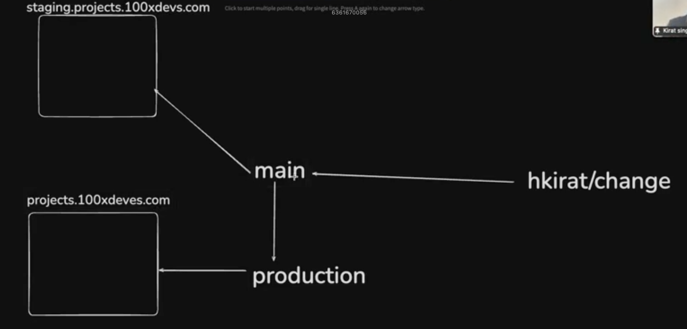
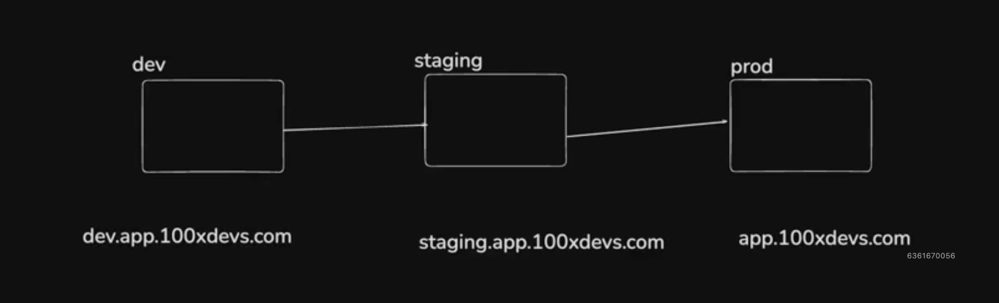

# Continuing CI, Certificate Management and Testing

### Topics to be covered : 

1. Deploying a monorepo (http, ws, prisma, postgres, next)
2. env variables
3. dev vs prod environments, periodic releases
4. Testing in CI pipelines
5. Cert management
6. CD pipeline to refresh certs every month

##

## 1. Deploying a monorepo (http, ws, prisma, postgres, next) :

Visit https://github.com/AmithBV0606/Monorepo-Deployment.git

## 2. environment variables : 


## 3. dev vs prod environments, periodic releases :

**Usually companies have 3 environments(branches)** : 

- Dev
- Staging (For testers)
- Production

NOTE : periodic release means pushing the code to "production" branch after a set interval time.




### Tasks : 

1. Create 2 servers on AWS or GCP or Azure or DigitalOcean. Name them as Dev and prod respectively.

2. ssh into both the server :
```zsh
ssh -i <private key file> ubuntu@<IP of Servers>
```

3. Add node.js using 'nvm' on both servers :
```zsh
curl -o- https://raw.githubusercontent.com/nvm-sh/nvm/v0.39.3/install.sh | bash

# And 

source ~/.bashrc
```

4. Install the "lts" version of Node.js on both servers : 
```zsh
nvm install --lts

# or 

nvm install <version_name>
```

**NOTE** : To check if the Node.js and npm has been successfully installed, run the following command :

```zsh
node -version
npm -version
```

5. Do a global pnpm install on both the servers : 
```zsh
npm install -g pnpm
```

6. Clone the monorepo to both the servers :
```zhs
git clone https://github.com/AmithBV0606/Monorepo-Deployment.git
```

7. Install node_modules folder for the project :
```zsh
pnpm install
```

8. Install nginx on both the servers :
```zsh
sudo apt update
sudo apt install nginx
```

9. Configure nginx :

Step 1 : 

```zsh
sudo rm sudo vi /etc/nginx/nginx.conf
sudo vi /etc/nginx/nginx.conf
```

Step 2 : 

- For dev server : 
```zsh
events {
    # Event directives...
}

http {
    # For Web
	server {
        listen 80;
        server_name  staging.week-25-fe.amithbv.com  ;

        location / {
            proxy_pass http://localhost:3000;
            proxy_http_version 1.1;
            proxy_set_header Upgrade $http_upgrade;
            proxy_set_header Connection 'upgrade';
            proxy_set_header Host $host;
            proxy_cache_bypass $http_upgrade;
        }
	}

    # For http-server
    server {
        listen 80;
        server_name  staging.week-25-http.amithbv.com  ;

        location / {
            proxy_pass http://localhost:3001;
            proxy_http_version 1.1;
            proxy_set_header Upgrade $http_upgrade;
            proxy_set_header Connection 'upgrade';
            proxy_set_header Host $host;
            proxy_cache_bypass $http_upgrade;
        }
	}

    # For ws-server
    server {
        listen 80;
        server_name  staging.week-25-ws.amithbv.com  ;

        location / {
            proxy_pass http://localhost:3002;
            proxy_http_version 1.1;
            proxy_set_header Upgrade $http_upgrade;
            proxy_set_header Connection 'upgrade';
            proxy_set_header Host $host;
            proxy_cache_bypass $http_upgrade;
        }
	}
}
```

- For production server : 
```zsh
events {
    # Event directives...
}

http {
    # For Web
	server {
        listen 80;
        server_name  week-25-fe.amithbv.com  ;

        location / {
            proxy_pass http://localhost:3000;
            proxy_http_version 1.1;
            proxy_set_header Upgrade $http_upgrade;
            proxy_set_header Connection 'upgrade';
            proxy_set_header Host $host;
            proxy_cache_bypass $http_upgrade;
        }
	}

    # For http-server
    server {
        listen 80;
        server_name  week-25-http.amithbv.com  ;

        location / {
            proxy_pass http://localhost:3001;
            proxy_http_version 1.1;
            proxy_set_header Upgrade $http_upgrade;
            proxy_set_header Connection 'upgrade';
            proxy_set_header Host $host;
            proxy_cache_bypass $http_upgrade;
        }
	}

    # For ws-server
    server {
        listen 80;
        server_name  week-25-ws.amithbv.com  ;

        location / {
            proxy_pass http://localhost:3002;
            proxy_http_version 1.1;
            proxy_set_header Upgrade $http_upgrade;
            proxy_set_header Connection 'upgrade';
            proxy_set_header Host $host;
            proxy_cache_bypass $http_upgrade;
        }
	}
}
```

Step 3 : 
```zsh
sudo nginx -s reload
```

10. Do a global build of all three projects i.e next, ws and http :
```zsh
pnpm run build
```

11. Since we need to keep the process running continuously, we need to install pm2 : 
```zsh
npm install -g pm2

# -g = global
```

12. Change directory(cd) into each apps i.e next, ws, http and run the following command :

- For http-server :
```zsh
pm2 start npm --name "http-server" -- start
```

- For web :
```zsh
pm2 start npm --name "web" -- start
```

- For ws-server :
```zsh
pm2 start npm --name "ws-server" -- start
```

13. Point our Domain names to the respective servers(Optional while learning but mandatory while actuall production) :

- For Development server :
    - staging.week-25-http.amithbv.com  
    - staging.week-25-ws.amithbv.com  
    - staging.week-25-fe.amithbv.com  

- For Production server :
    - week-25-http.amithbv.com  
    - week-25-ws.amithbv.com  
    - week-25-fe.amithbv.com  

14. Refresh nginx config.

15. Test that everything is working.

# Continuous Integration/Continuous Deployment (CI/CD)

### Continuous Deployment (CD) :

- Visit https://github.com/AmithBV0606/Monorepo-Deployment.git

- Create a `.github` folder, where all the workflows(CI/CD) will be written.

- GitHub will spawn a new server(ubuntu) which will then SSH into my EC2 instance and redeploy the code.