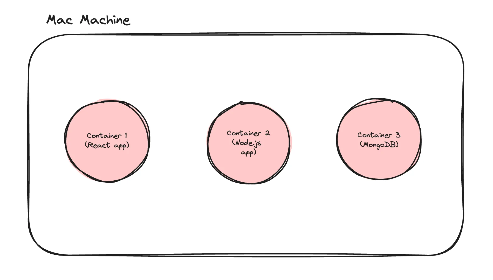
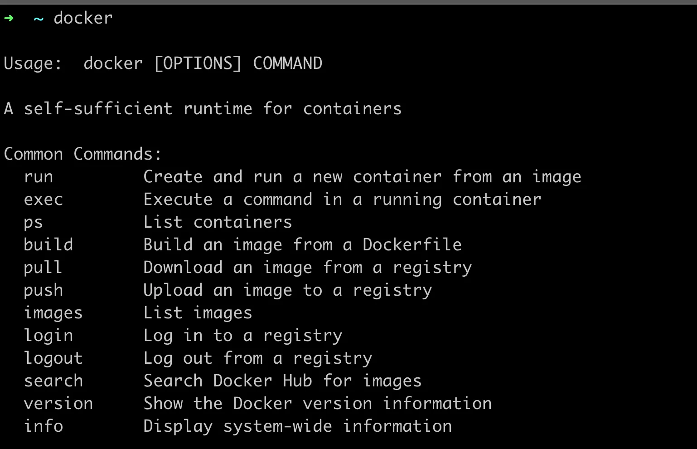
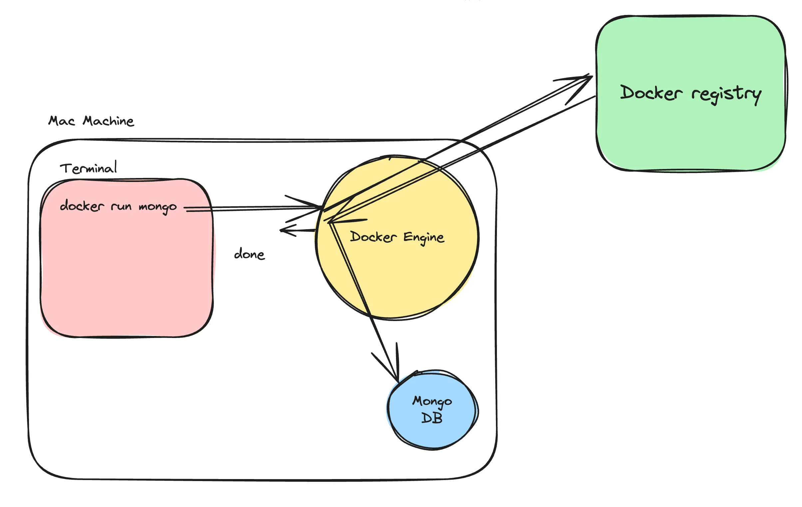
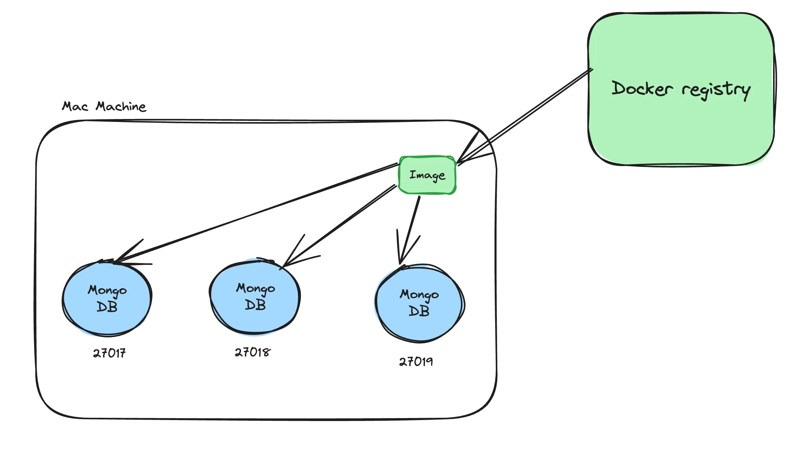
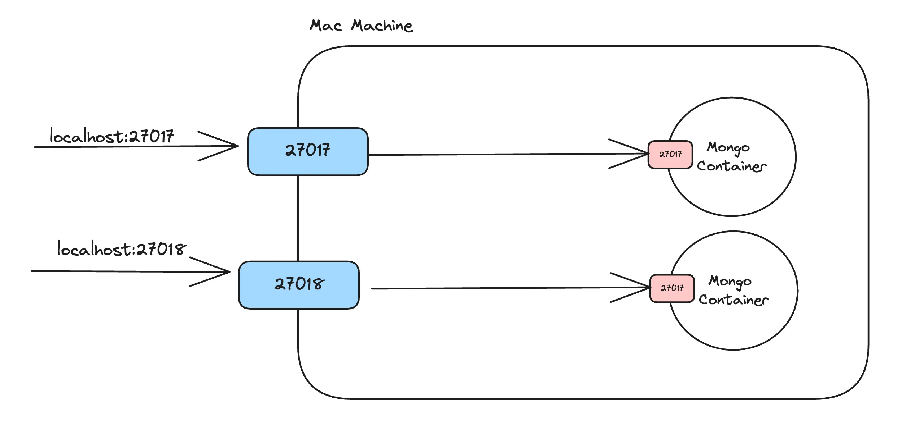
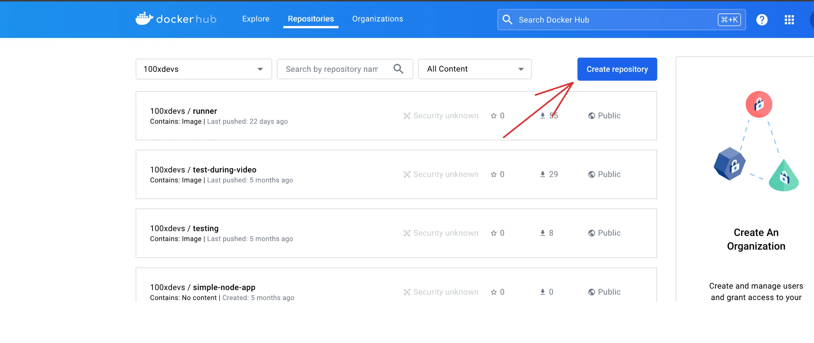

# 26.1 | Docker Part-1

### Step 1 : Why Docker?

Docker/containers are important for a few reasons - 

1. Kubernetes/Container orchestration
2. Running processes in isolated environments
3. Starting projects/auxilary services locally

##

### Step 2 - Containerization

- In Docker, a container is a runnable instance of a Docker image.

- Containers are a way to package and distribute software applications in a way that makes them easy to deploy and run consistently across different environments. 

- They allow you to package an application, along with all its dependencies and libraries, into a single unit that can be run on any machine with a container runtime, such as Docker.

### Why containers?

1. Everyone has different Operating systems.

2. Steps to run a project can vary based on OS.

3. Extremely harder to keep track of dependencies as project grows.

### Benefits of using containers


 
1. Let you describe your configuration in a single file

2. Can run in isolated environments

3. Makes Local setup of OS projects a breeze

4. Makes installing auxiliary services/DBs easy

**References** :

- For Reference, the following command starts mongo in all operating systems - 

```zsh
docker run -d -p 27017:27017 mongo
```

NOTE : Docker isn’t the only way to create containers

##

### Step 3 - History of Docker

- Docker is a YC backed company, started in ~2014

- They envisioned a world where containers would become mainstream and people would deploy their applications using them.

- That is mostly true today.

- Most projects that you open on Github will/should have docker files in them (a way to create docker containers)
 
Ref - https://www.ycombinator.com/blog/solomon-hykes-docker-dotcloud-interview/

##

### Step 4 - Installing docker

Ref - https://docs.docker.com/engine/install/

NOTE : Make sure you’re able to run the docker cli locally.



##

### Step 5 - Inside docker



As an application/full stack developer, you need to be comfortable with the following terminologies -

1. **Docker Engine** : Creates and runs container.

- First thing which gets installed while installing the Docker locally.

- Docker Engine is an open-source containerization technology that allows developers to package applications into container.

- Containers are standardized executable components combining application source code with the operating system (OS) libraries and dependencies required to run that code in any environment.

2. **Docker CLI** :

- The command line interface lets you talk to the docker engine and lets you start/stop/list containers.

```zsh
docker run -d -p 27017:27017 mongo
```

NOTE : Docker cli is not the only way to talk to a docker engine. You can hit the docker REST API to do the same things.


3. **Docker registry** : 

- The docker registry is how Docker makes money. 

- It is similar to github, but it lets you push images rather than sourcecode.

- Docker’s main registry - https://dockerhub.com/

- Mongo image on docker registry - https://hub.docker.com/_/mongo

##

### Step 6 - Images vs containers

**Docker Image** :

A Docker image is a lightweight, standalone, executable package that includes everything needed to run a piece of software, including the code, a runtime, libraries, environment variables, and config files.

    💡 A good mental model for an image is Your codebase on github.

**Docker Container** :

A container is a running instance of an image. It encapsulates the application or service and its dependencies, running in an isolated environment.

    💡 A good mental model for a container is when you run `node index.js` on your machine from some source code you got from github.

NOTE : Image is like cloning the codebase and container is like running that codebase locally.



##

### Step 7 - Port mapping

```zsh
# docker run -d -p Your local machine port:Docker container port mongo

docker run -d -p 27018:27017 mongo
```



## 

### Step 8 - Common docker commands

1. **docker images** : Shows you all the images that you have on your machine.

```zsh
docker images
```

2. **docker ps** : Shows you all the containers you are running on your machine.

```zsh
docker ps
```

3. **docker run** : Lets you start a container

    - `-p` ⇒ let’s you create a port mapping
    - `-d` ⇒ Let’s you run it in detatched mode

Example : 
```zsh
docker run -p 27017:27017 mongo
docker run -d -p 27017:27017 mongo
```

4. **docker kill** : Let you kill a running container.

```zsh
docker kill <CONTAINER_ID>
```

5. **docker build** : Lets you build an image. We will see this after we understand how to create your own Dockerfile.

6. **docker push** : Lets you push your image to a registry.

7. **To access the terminal of a docker container** : 

```zsh
docker exec

# Example 
docker exec -it <CONTAINER_ID> sh
# OR
docker exec -it <CONTAINER_ID> /bin/bash
```

`-it` - Interactive mode flag.

##

### Step 9 - Dockerfile

#### What is a Dockerfile?

- If you want to create an image from your own code, that you can push to dockerhub, you need to create a Dockerfile for your application.

- A Dockerfile is a text document that contains all the commands a user could call on the command line to create an image.

#### How to write a dockerfile?

A dockerfile has 2 parts : 

1. Base image.

2. Bunch of commands that you run on the base image (to install dependencies like Node.js)

#### Dockerfile Demo :


### Common commands

- `WORKDIR` : Sets the working directory for any RUN, CMD, ENTRYPOINT, COPYinstructions that follow it.

- `RUN` : Executes any commands in a new layer on top of the current image and commits the results.

- `CMD` : Provides defaults for executing a container. There can only be one CMD instruction in a Dockerfile.

- `EXPOSE` : Informs Docker that the container listens on the specified network ports at runtime.

- `ENV` : Sets the environment variable.

- `COPY` : Allow files from the Docker host to be added to the Docker image.

##

### Step 10 - Building images

- Now that you have a dockerfile in your project, try building a docker image from it

```zsh
docker build -t image_name .
```

- Now if you try to look at your images, you should notice a new image created.

```zsh
docker images
```
 
    💡 Add a .dockerignore so that node_modules don’t get copied over .

##

### Step 11 - Running images

```zsh
docker run --name container_name -d -p 3000:3000 image_name

# OR

docker run -p 3000:3000 image_name
```

- Try visiting localhost:3000

##

### Step 12 - Passing in env variables

```zsh
docker run -p 3000:3000 -e DATABASE_URL="http://postgres.ejsdbvjkns" image_name
```

- The `-e` argument let’s you send in environment variables to your `node.js` app.

##

### Step 13 - More commands

- docker kill - to kill a container
```zsh
docker kill container_id
```

- docker exec - to exectue a command inside a container
 
Examples :

1. List all contents of a container folder :
```zsh
docker exec <container_name_or_id> ls /path/to/directory
```

2. Running an Interactive Shell :
```zsh
docker exec -it <container_name_or_id> /bin/bash
```

##

### Step 14 - Pushing to dockerhub

Once you’ve created your image, you can push it to dockerhub to share it with the world.

1. Signup to dockerhub
2. Create a new repository



3. Login to docker cli
    - docker login
    - you might have to create an access token - https://docs.docker.com/security/for-developers/access-tokens/

4. Push to the repository.
```zsh
docker push your_username/your_reponame:tagname
```