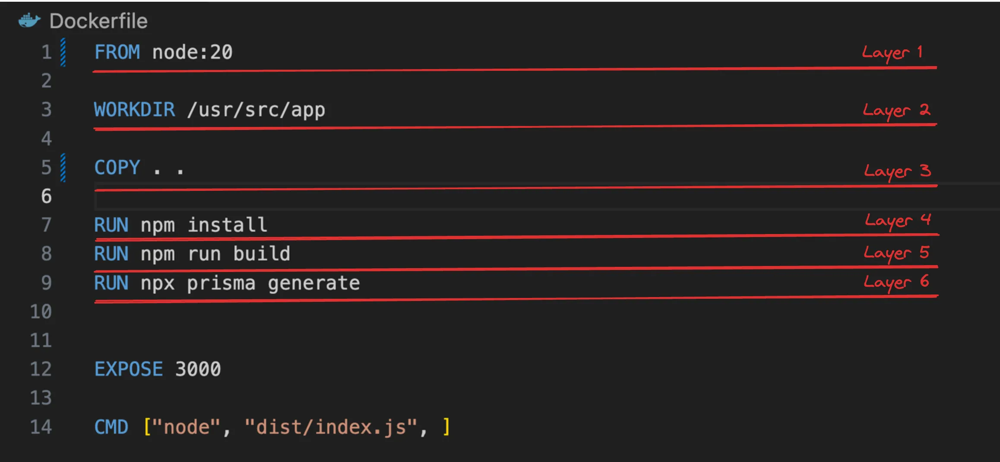
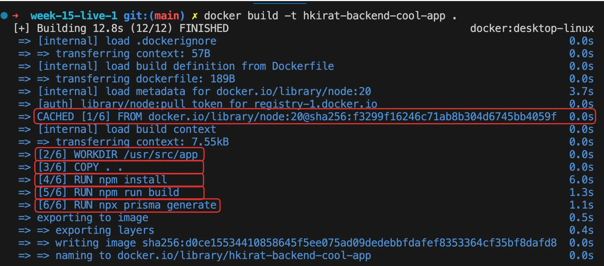
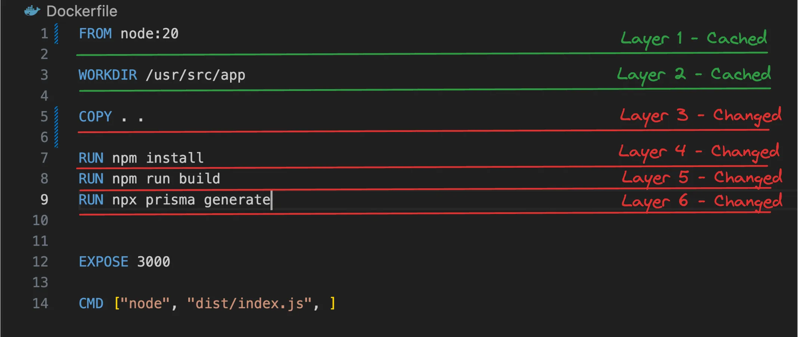
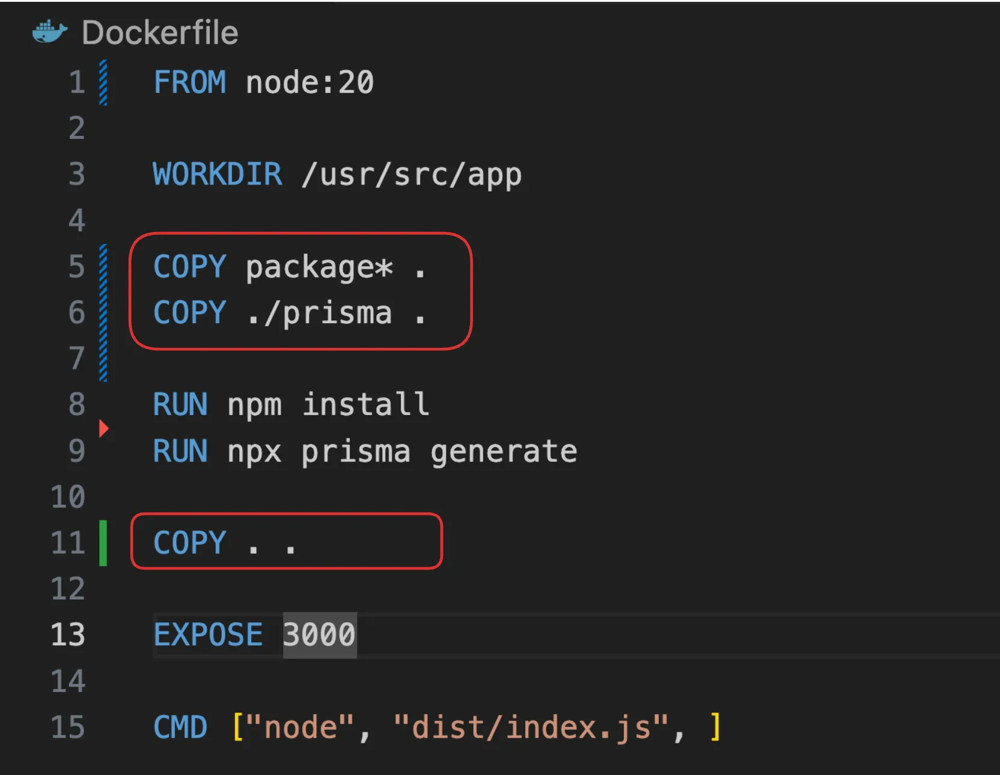
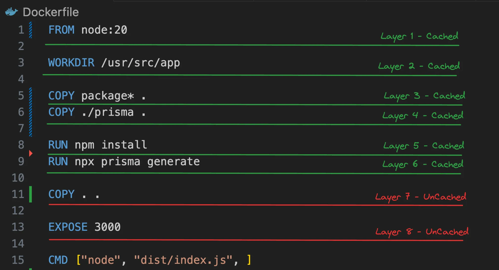
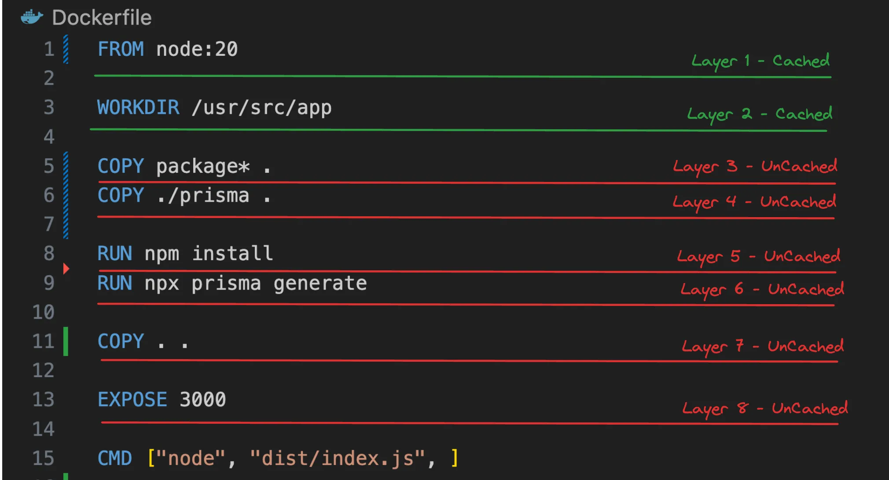
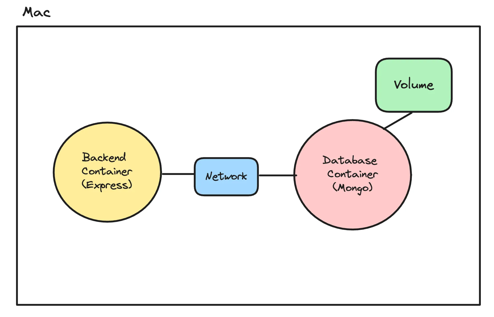
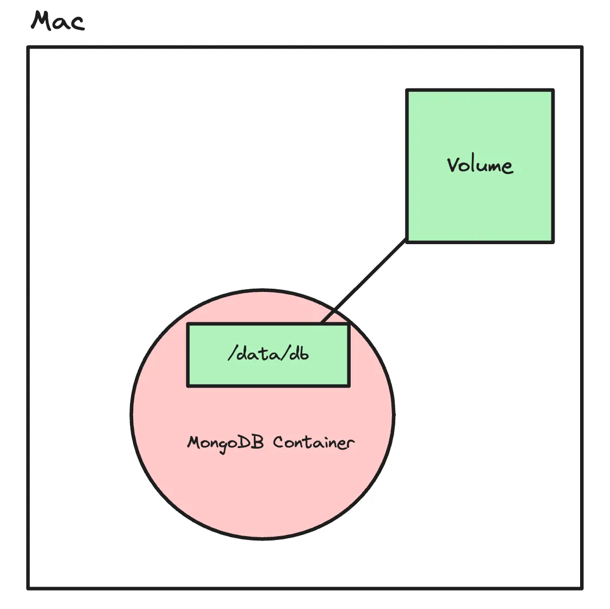
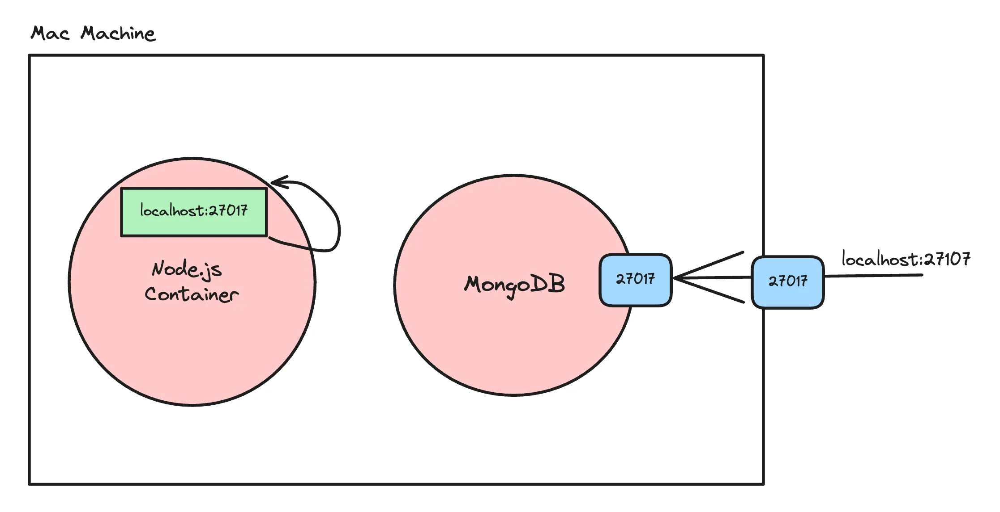
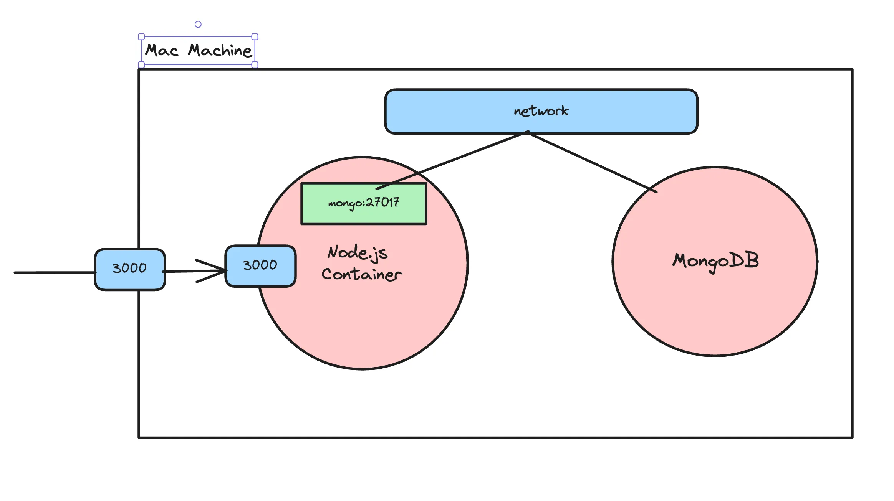

# 26.2 | Docker Part - 2

### Step 15 - Layers in Docker

- In Docker, layers are a fundamental part of the image architecture that allows Docker to be efficient, fast, and portable. 

- A Docker image is essentially built up from a series of layers, each representing a set of differences from the previous layer.

### How layers are made - 

1. **Base Layer :** The starting point of an image, typically an operating system (OS) like Ubuntu, Alpine, or any other base image specified in a Dockerfile.

2. **Instruction Layers :** Each command in a Dockerfile creates a new layer in the image. These include instructions like `RUN`, `COPY`, which modify the filesystem by installing packages, copying files from the host to the container, or making other changes. Each of these modifications creates a new layer on top of the base layer.

3. **Reusable & Shareable :** Layers are cached and reusable across different images, which makes building and sharing images more efficient. If multiple images are built from the same base image or share common instructions, they can reuse the same layers, reducing storage space and speeding up image downloads and builds.

4. **Immutable :** Once a layer is created, it cannot be changed. If a change is made, Docker creates a new layer that captures the difference. This immutability is key to Docker's reliability and performance, as unchanged layers can be shared across images and containers.

##

### Step 16 - Layers practically

For a simple Node.js app -

**Dockerfile** :


**Logs** :


**Observations -**

1. Base image creates the first layer.

2. Each `RUN`, `COPY` , `WORKDIR`  command creates a new layer.

3. Layers can get re-used across docker builds (notice CACHED in 1/6).

##

### Step 17 - Why layers?

If you change your Dockerfile, layers can get re-used based on where the change was made

    💡 If a layer changes, all subsequent layers also change.

**Case 1** : You change your source code.


Logs : 


**Case 2** : You change the package.json file (added a dependency).


Logs : 


**Thought experiment**

1. How often in a project do you think dependencies change?

2. How often does the npm install layer need to change?

3. Wouldn’t it be nice if we could cache the npm install step considering dependencies don’t change often?

##

### Step 18 - Optimising Dockerfile

What if we change the Dockerfile a bit - 



1. We first copy over only the things that npm install and npx prisma generate need.

2. Then we run these scripts.

3. Then we copy over the rest of the source code.

**Case 1 :** You change your source code (but nothing in package.json/prisma) :



**Case 2 :** You change the package.json file (added a dependency) :



##

### Step 19 - Networks and volumes

Networks and volumes are concepts that become important when you have multiple containers running in which you

1.Need to persist data across docker restarts.

2.Need to allow containers to talk to each other.



##

### Step 20 - Volumes

If you restart a `mongo` docker container, you will notice that your data goes away. 

This is because docker containers are `transitory` (they don’t retain data across restarts).

### Without Volumes 

1. Start a mongo container locally :
```bash
docker run -p 27017:27017 -d mongo
```

2. Open it in MongoDB Compass and add some data to it.

3. Kill the container : 
```bash
docker kill <container_id>
```

4. Create a new container : 
```bash
docker run -p 27017:27017 -d mongo
```

**NOTE :** 

- Try to explore the database in Compass and check if the data has persisted (it wouldn’t).

- But if you restart the same old container again the data will be present.

### Solution : With Volumes :

1. Create a volume :
```bash
docker volume create volume_database
```

2. Mount the folder in mongo which actually stores the data to volume created in the last step : 
```bash
docker run -v volume_database:/data/db -p 27017:27017 mongo
```

3. Open it in MongoDB Compass and add some data to it.

4. Kill the container :
```bash
docker kill <container_id>
```

5. Create a new container : 
```bash
docker run -v volume_database:/data/db -p 27017:27017 mongo
```

**NOTE :**

- Try to explore the database in Compass and check if the data has persisted (it will!).

- Never mount a same volume to the multiple container simultaneously. 



##

### Step 21 - Network
 
- In Docker, a network is a powerful feature that allows containers to communicate with each other and with the outside world.

- Docker containers can’t talk to each other by default.

- `localhost` on a docker container means it's own network and not the network of the `host machine`.



### How to make containers talk to each other?

**Attach them to the same network.**

1. Clone the repo - https://github.com/100xdevs-cohort-2/week-15-live-2.2

2. Build the image :
```bash
docker build -t image_tag .
```

3. Create a network : 
```bash
docker network create my_custom_network
```

4. Start mongo on the same network :
```bash
docker run -d -v volume_database:/data/db --name mongodbContainer --network my_custom_network -p 27017:27017 mongo
```

**NOTE :** The name of the mongo container should be same as the connection string name i.e `mongodbContainer`.

5. Start the backend process with the network attached to it :
```bash
docker run -p 3000:3000 --name backendContainer --network my_custom_network image_tag
```

6. Check the logs to ensure the db connection is successful :
```bash
docker logs <container_id>
```

7. Try to visit an endpoint and ensure you are able to talk to the database.

**NOTE :**
If you want, you can remove the port mapping for mongo since you don’t necessarily need it exposed on your machine.

### After using Networks : 


### Types of networks :

1. **Bridge :** The default network driver for containers. When you run a container without specifying a network, it's attached to a bridge network. It provides a private internal network on the host machine, and containers on the same bridge network can communicate with each other.

2. **Host :** Removes network isolation between the container and the Docker host, and uses the host's networking directly. This is useful for services that need to handle lots of traffic or need to expose many ports.